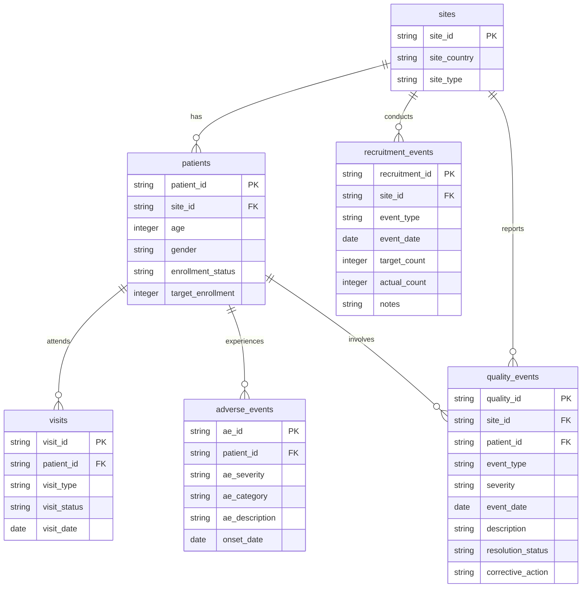

# Clinical Trial Database Schema

```mermaid
erDiagram
    sites {
        string site_id PK
        string site_country
        string site_type
    }

    patients {
        string patient_id PK
        string site_id FK
        integer age
        string gender
        string enrollment_status
        integer target_enrollment
    }

    visits {
        string visit_id PK
        string patient_id FK
        string visit_type
        string visit_status
        date visit_date
    }

    adverse_events {
        string ae_id PK
        string patient_id FK
        string ae_severity
        string ae_category
        string ae_description
        date onset_date
    }

    recruitment_events {
        string recruitment_id PK
        string site_id FK
        string event_type
        date event_date
        integer target_count
        integer actual_count
        string notes
    }

    quality_events {
        string quality_id PK
        string site_id FK
        string patient_id FK
        string event_type
        string severity
        date event_date
        string description
        string resolution_status
        string corrective_action
    }

    sites ||--o{ patients : "has"
    patients ||--o{ visits : "attends"
    patients ||--o{ adverse_events : "experiences"
    sites ||--o{ recruitment_events : "conducts"
    sites ||--o{ quality_events : "reports"
    patients ||--o{ quality_events : "involves"
```
