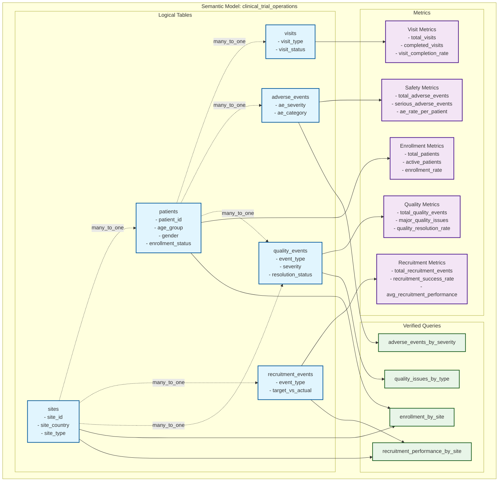

# Clinical Trial Semantic Model

```mermaid
graph TB
    subgraph "Semantic Model: clinical_trial_operations"
        subgraph "Logical Tables"
            LT1[patients<br/>- patient_id<br/>- age_group<br/>- gender<br/>- enrollment_status]
            LT2[sites<br/>- site_id<br/>- site_country<br/>- site_type]
            LT3[visits<br/>- visit_type<br/>- visit_status]
            LT4[adverse_events<br/>- ae_severity<br/>- ae_category]
            LT5[recruitment_events<br/>- event_type<br/>- target_vs_actual]
            LT6[quality_events<br/>- event_type<br/>- severity<br/>- resolution_status]
        end

        subgraph "Metrics"
            M1[Enrollment Metrics<br/>- total_patients<br/>- active_patients<br/>- enrollment_rate]
            M2[Visit Metrics<br/>- total_visits<br/>- completed_visits<br/>- visit_completion_rate]
            M3[Safety Metrics<br/>- total_adverse_events<br/>- serious_adverse_events<br/>- ae_rate_per_patient]
            M4[Recruitment Metrics<br/>- total_recruitment_events<br/>- recruitment_success_rate<br/>- avg_recruitment_performance]
            M5[Quality Metrics<br/>- total_quality_events<br/>- major_quality_issues<br/>- quality_resolution_rate]
        end

        subgraph "Verified Queries"
            VQ1[enrollment_by_site]
            VQ2[adverse_events_by_severity]
            VQ3[recruitment_performance_by_site]
            VQ4[quality_issues_by_type]
        end
    end

    %% Relationships
    LT2 -.->|many_to_one| LT1
    LT1 -.->|many_to_one| LT3
    LT1 -.->|many_to_one| LT4
    LT2 -.->|many_to_one| LT5
    LT2 -.->|many_to_one| LT6
    LT1 -.->|many_to_one| LT6

    %% Metric connections
    LT1 --> M1
    LT3 --> M2
    LT4 --> M3
    LT5 --> M4
    LT6 --> M5

    %% Query connections
    LT1 --> VQ1
    LT2 --> VQ1
    LT4 --> VQ2
    LT2 --> VQ3
    LT5 --> VQ3
    LT6 --> VQ4

    classDef tableClass fill:#e1f5fe,stroke:#01579b,stroke-width:2px
    classDef metricClass fill:#f3e5f5,stroke:#4a148c,stroke-width:2px
    classDef queryClass fill:#e8f5e8,stroke:#1b5e20,stroke-width:2px

    class LT1,LT2,LT3,LT4,LT5,LT6 tableClass
    class M1,M2,M3,M4,M5 metricClass
    class VQ1,VQ2,VQ3,VQ4 queryClass
```
